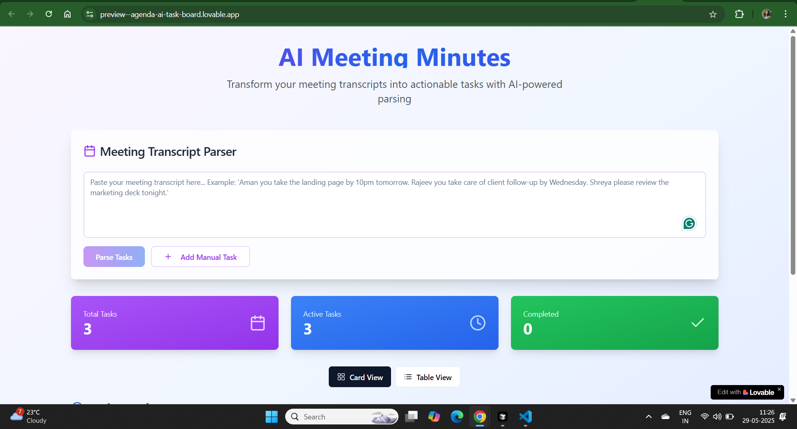
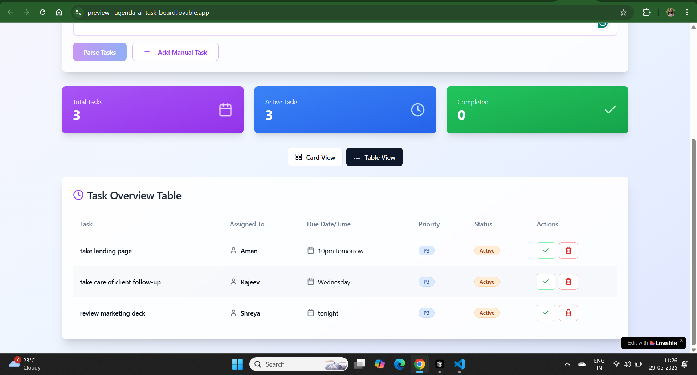
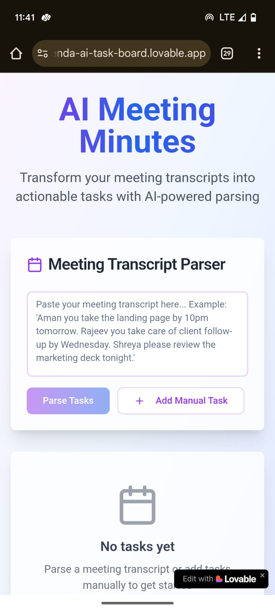
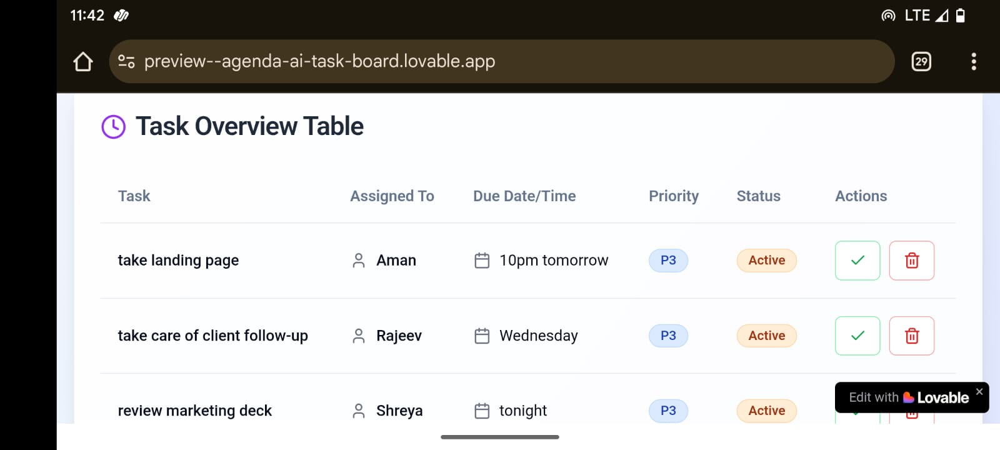

# AI Meeting Minutes to Task Converter

A modern, AI-powered web application that transforms meeting transcripts into actionable tasks with intelligent parsing and beautiful task management interface.

## 🚀 Features

- **AI-Powered Transcript Parsing**: Automatically extract tasks, assignees, deadlines, and priorities from meeting transcripts
- **Dual View Modes**: Toggle between card view and table view for different task visualization needs
- **Smart Task Detection**: Handles various formats of task assignments in natural language
- **Priority Management**: Automatic priority detection (P1/High, P2/Medium, P3/Normal) with color-coded badges
- **Task Management**: Complete, reopen, and delete tasks with real-time updates
- **Responsive Design**: Optimized for both desktop and mobile devices
- **Modern UI**: Clean, intuitive interface with gradient backgrounds and smooth animations

## 📋 Task Extraction Examples

The AI parser can understand various formats:

```
"Aman you take the landing page by 10pm tomorrow"
→ Task: landing page | Assignee: Aman | Deadline: 10pm tomorrow | Priority: P3

"Rajeev you take care of client follow-up by Wednesday"
→ Task: client follow-up | Assignee: Rajeev | Deadline: Wednesday | Priority: P3

"Shreya please review the marketing deck tonight"
→ Task: marketing deck | Assignee: Shreya | Deadline: tonight | Priority: P3
```

## 🛠️ Setup Instructions

### Prerequisites

- Node.js (v18 or higher)
- npm or yarn package manager

### Installation

1. **Clone the repository**
   ```bash
   git clone <your-repository-url>
   cd ai-meeting-minutes
   ```

2. **Install dependencies**
   ```bash
   npm install
   ```

3. **Start the development server**
   ```bash
   npm run dev
   ```

4. **Open your browser**
   Navigate to `http://localhost:5173` to see the application

### Build for Production

```bash
npm run build
```

## 🎯 Usage

1. **Paste Meeting Transcript**: Copy your meeting transcript into the text area
2. **Parse Tasks**: Click "Parse Tasks" to automatically extract actionable items
3. **View Tasks**: Switch between card view and table view using the toggle buttons
4. **Manage Tasks**: 
   - Mark tasks as complete/incomplete
   - Delete tasks that are no longer needed
   - Add manual tasks using the "Add Manual Task" button

## 🏗️ Technology Stack

- **Frontend Framework**: React 18 with TypeScript
- **Build Tool**: Vite
- **Styling**: Tailwind CSS with custom gradients and animations
- **UI Components**: Shadcn/UI component library
- **Icons**: Lucide React
- **State Management**: React Hooks (useState)
- **Notifications**: Custom toast system

## 📁 Project Structure

```
src/
├── components/
│   ├── ui/              # Shadcn/UI components
│   ├── TaskCard.tsx     # Individual task card component
│   ├── TaskTable.tsx    # Table view for tasks
│   └── AddTaskForm.tsx  # Form for manual task creation
├── utils/
│   └── transcriptParser.ts  # AI parsing logic
├── pages/
│   └── Index.tsx        # Main application page
├── hooks/
│   └── use-toast.ts     # Toast notification hook
└── lib/
    └── utils.ts         # Utility functions
```

## 🎨 Design Features

- **Color-coded Priorities**: 
  - 🔴 P1 (High): Red badges for urgent tasks
  - 🟡 P2 (Medium): Yellow badges for important tasks  
  - 🔵 P3 (Normal): Blue badges for regular tasks
- **Responsive Layout**: Adapts to different screen sizes
- **Smooth Animations**: Hover effects and transitions
- **Modern Gradients**: Purple-to-blue gradient theme
- **Glass Morphism**: Semi-transparent cards with backdrop blur

## 🔧 Configuration

The transcript parser can be customized by modifying the patterns in `src/utils/transcriptParser.ts`. You can add new regex patterns to handle different formats of task assignments.

## 📱 Screenshots

### Desktop View - Card Layout


### Desktop View - Table Layout  


### Mobile View


### Task Parsing Demo


## 🤝 Contributing

1. Fork the repository
2. Create a feature branch (`git checkout -b feature/amazing-feature`)
3. Commit your changes (`git commit -m 'Add amazing feature'`)
4. Push to the branch (`git push origin feature/amazing-feature`)
5. Open a Pull Request

## 📄 License

This project is licensed under the MIT License - see the LICENSE file for details.

## 🚀 Deployment

This project can be easily deployed to:
- **Vercel**: Connect your GitHub repository for automatic deployments
- **Netlify**: Drag and drop the build folder or connect via Git
- **GitHub Pages**: Use the build output for static hosting

### Deploy to Vercel
```bash
npm run build
npx vercel --prod
```

## ⚡ Performance

- **Bundle Size**: Optimized with tree-shaking and code splitting
- **Loading Speed**: Fast initial load with minimal dependencies
- **Responsive**: Smooth interactions on all device sizes
- **Memory Efficient**: Clean component lifecycle management

## 🔮 Future Enhancements

- [ ] Integration with calendar applications
- [ ] Export tasks to popular project management tools
- [ ] Voice-to-text transcript input
- [ ] Team collaboration features
- [ ] Advanced priority detection with NLP
- [ ] Task dependencies and subtasks
- [ ] Due date reminders and notifications
